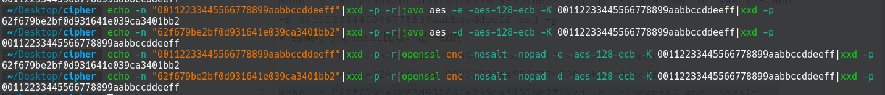
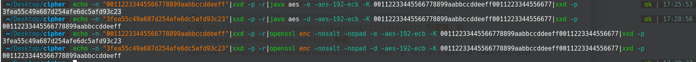
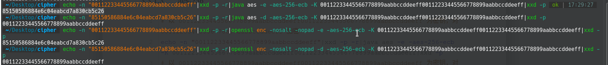
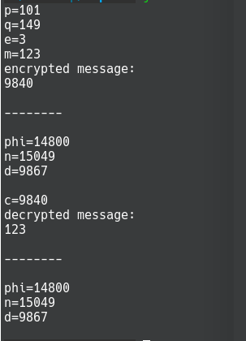
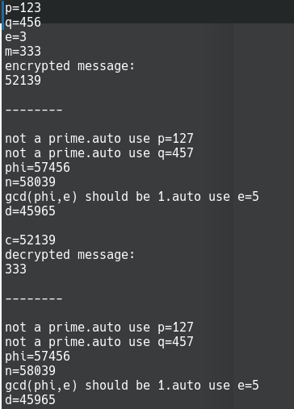
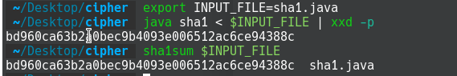

# AES,RSA,SHA1 的简单java实现

3个经典算法，根据《深入浅出密码学》编写。

## 简介

### AES

aes.java 程序实现了3个算法，包括加密与解密，分别是AES-128、AES-192、AES-256。

在类Utils中实现了主要的计算与工具函数，

主要的算法方面包括exgcd,FGmultiply,FGdiv,FGexgcd,FGinverse,subBytes,invSubBytes,shiftRow,invShiftRow,mixCoumn,invMixColumn,addRoundKey,keyExpansion128， keyExpansion192， keyExpansion256 等。


#### 数学计算工具函数

AES的计算大多都设计FG域的计算，故首先要做的就是设计并调试好数学相关函数。

FGmultiply,FGdiv分别是FG域的乘法和除法，乘法在Mixcolumn会用到，而除法就是用于FG域扩展欧几里得算法中。

```java
//FG域的乘法
static byte FGmultiply(byte a,byte b){
	byte result = (byte)0x00;
	//将b的每一位与a的每一位相乘，a一旦超出一个字节则模0x011b
	for(int i=0;i<8;i++){
		result ^= ((b >> i) & 0x01) * a;
		a = ((a & (byte)0x80) != (byte)0x00) ? (byte)((byte)0x1b ^ (byte)(a<<1)) : (byte)(a<<1);
	}
	return result;
}
//FG域的除法，返回数组，arr[0]为商，arr[1]为余数
static byte[] FGdiv(char a,char b){
	//检查a是否更小，得出余数
	int am=8,bm=8;
	while(((1<<am)&a)==0 && am>=0)
		am--;
	while(((1<<bm)&b)==0 && bm>=0)
		bm--;
	if(am<bm)
		return new byte[]{0,(byte)a};

	//将b左移，相减得到新的a
	int deg = am - bm;
	a = (char)((char)a ^ (char)(b << deg));
	//递归
	byte[] br = FGdiv(a,b);
	//商增加
	br[0] |= (1 << deg);
	return br;
}
```


FGexgcd就是FG域的扩展欧几里得算法，由欧几里得算法改编而得，用于FG域的求逆元函数FGinverse。0的逆元不存在，但在这个求逆元算法中可以正确输出0。AES规定同余x^8+x^4+x^3+x+1，FGinverse的输入只需一个变量即可。这个数转成16进制是11B，一个byte不足以表示，需要转成char来计算，有点麻烦。

```java
//自然数的扩展欧几里得算法
static int exgcd(int a,int b,int[] arr){
	if(b == 0){
		arr[0]=1;
		arr[1]=0;
		return a;
	}
	int g = exgcd(b,a%b,arr);
	int t = arr[0];
	arr[0]=arr[1];//x1=y2
	arr[1]=t-(a/b)*arr[1];//y1=x2-[a/b]*y2
	return g;
}
//FG域的扩展欧几里得算法，仅需替换四则运算为FG域的相应运算
static byte FGexgcd(char a,char b,byte[] arr){
	//System.out.println(a+0);
	if(b == 0){
		//System.out.println("found");
		arr[0]=(byte)0x01;
		arr[1]=(byte)0x00;
		return (byte)a;
	}
	byte g = FGexgcd(b,(char)Utils.FGdiv(a,b)[1],arr);
	//System.out.println(g&0xff);
	byte t = arr[0];
	arr[0]=arr[1];
	arr[1]=(byte)( t ^ Utils.FGmultiply(Utils.FGdiv(a,b)[0],arr[1]));
	return g;
}
```
有了FG域的扩展欧几里得算法，就可以容易地写出FG域的求逆元函数。

```java
//FG域的求逆 因为gcd(0x11B,x)==1，用FGexgcd得到[s,t]，其中s·0x11B + t·x = 1,则有 t·x = 1 mod 0x11B，返回t即可
static byte FGinverse(byte x){
	char a = (char)0x11B;
	char b = (char)(x & 0xff);
	//System.out.println(b+0);
	byte[] arr = {(byte)0x00,(byte)0x00};
	Utils.FGexgcd(a,b,arr);
	return(arr[1]);

}
```

#### aes内部结构函数

接下来终于可以开始AES中4种层的编写了

但首先写一个工具函数：getBit，从右边数起，获取某个位的值。

```java
static int getBit(byte b,int i){
	return ((b>>i) & 0x01);
}
```

subBytes函数完成了字节代换层的操作。

在这里，我尝试了不用S盒，而是先求出FG域下的逆元再与常量位矩阵相乘，然后和0x63相加。

InvSubBytes是它的逆，同理。

```java
//字节代换层
static byte subBytes(byte x){
	//采用计算而非查S盒
	x = FGinverse(x);
	byte c = (byte)0x63;
	byte result = (byte)0x00;
	//通过循环得到result的每一位
	for(int i=0;i<8;i++){
		result = (byte)( result | ((getBit(x,i)^getBit(x,(i+4)%8)^getBit(x,(i+5)%8)^getBit(x,(i+6)%8)^getBit(x,(i+7)%8)^getBit(c,i)) << i));
	}
	return result;
}
//逆向字节代换层
static byte invSubBytes(byte x){
	byte d = (byte)0x05;
	byte result = (byte)0x00;
	for(int i=0;i<8;i++){
		result = (byte)( result | ((getBit(x,(i+2)%8)^getBit(x,(i+5)%8)^getBit(x,(i+7)%8)^getBit(d,i)) << i));
	}
	result = FGinverse(result);
	return result;
}
```

 

shiftRow是扩散层的第一步，对行进行移位。invShiftRow是其逆。

```java
//行移位变换
static byte[] shiftRow(byte[] a){	
	byte[] b = new byte[16];
	for(int i=0;i<4;i++){
		b[i*4]=a[i*4];
		b[i*4+1]=a[(i*4+5)%16];
		b[i*4+2]=a[(i*4+10)%16];
		b[i*4+3]=a[(i*4+15)%16];
	}
	return b;

}
//逆向行移位变换
static byte[] invShiftRow(byte[] a){
	byte[] b = new byte[16];
	for(int i=0;i<4;i++){
		b[i*4]=a[i*4];
		b[i*4+1]=a[(i*4+13)%16];
		b[i*4+2]=a[(i*4+10)%16];
		b[i*4+3]=a[(i*4+7)%16];
	}
	return b;
}
```

 

mixColumn是扩散层第二步，可表示为与一个4x4的矩阵相乘。因为矩阵里有01 02的存在，故可以用先都取1的方式加快计算速度，然后再算x02，不过求逆时的矩阵没这么简单，就不能这样了。

```java
//列混淆变换
static byte[] mixColumn(byte[] a){
	byte[] b = new byte[16];
	for(int i=0;i<4;i++){
		byte g = (byte)( a[i*4] ^ a[i*4+1] ^ a[i*4+2] ^ a[i*4+3]);
		for(int j=0;j<4;j++){
			b[i*4+j]=(byte)(g ^ a[i*4+j] ^ (((a[i*4+j] & (byte)0x80) != (byte)0x00) ? (byte)((byte)0x1b ^ (byte)(a[i*4+j]<<1)) : (byte)(a[i*4+j]<<1)) ^ (((a[i*4+(j+1)%4] & (byte)0x80) != (byte)0x00) ? (byte)((byte)0x1b ^ (byte)(a[i*4+(j+1)%4]<<1)) : (byte)(a[i*4+(j+1)%4]<<1)));
		}
	}
	return b;
}
//逆向列混淆变换
static byte[] invMixColumn(byte[] a){
	byte[] b = new byte[16];
	for(int i=0;i<4;i++){
		for(int j=0;j<4;j++){
			b[i*4+j]=(byte)( Utils.FGmultiply(a[i*4+j],(byte)0x0E) ^ Utils.FGmultiply(a[i*4+(j+1)%4],(byte)0x0B) ^ Utils.FGmultiply(a[i*4+(j+2)%4],(byte)0x0D) ^ Utils.FGmultiply(a[i*4+(j+3)%4],(byte)0x09));
		}
	}
	return b;
}
```

密钥加法层中，我选择了先算出所有子密钥，按序放在一个byte数组ke中，然后每次取出16个相加。下面亦展示了aes128/aes192/aes256的子密钥计算，其实完成128后只要稍作修改就可写出192和256，要注意的是要分布加上g()和h()，详见代码注释。

```java
//密钥加法层
static void addRoundKey(byte[] a,byte[] k,int start){
	for(int i=0;i<16;i++){
		a[i] = (byte)(a[i] ^ k[i+start]);
	}
}
//密钥编排之128位密钥，10轮迭代得到(4+10*4)4=/11个子密钥，返回11*16=176bytes的子密钥
static byte[] keyExpansion128(byte[] k){
	byte[] ke = new byte[176];
	//轮系数
	byte rc = (byte)0x01;
	//轮密钥0
	for(int i=0;i<16;i++)
		ke[i]=k[i];
	//轮密钥1 ~ 轮密钥10 每轮计算4个word 一个word是4bytes
	for(int r=1;r<=10;r++){
		//对前一个word发动増殖するG
		for(int i=0;i<4;i++){
			ke[r*16+i]=ke[r*16-4+(i+1)%4];
			ke[r*16+i]=Utils.subBytes(ke[r*16+i]);
		}
		ke[r*16] = (byte)( ke[r*16] ^ rc );
		//rc变换
		rc=Utils.FGmultiply(rc,(byte)0x02);
		//完成首个word，在g的基础上加上前数第4个word
		for(int i=0;i<4;i++){
			ke[r*16+i] = (byte)(ke[r*16+i] ^ ke[r*16-16+i]);
			//System.out.println("ke["+(r*16+i)+"]="+byte2string(ke[r*16+i]));
		}
		//剩下3个word
		for(int m=1;m<=3;m++){
			for(int i=0;i<4;i++){
				ke[r*16+m*4+i] = (byte)(ke[r*16+m*4-4+i] ^ ke[r*16-16+m*4+i]);
			}
		}
	}
	return ke;
}

//密钥编排之192位密钥，8轮迭代得到(6+7*6+4)/4=13个子密钥，返回13*16=208bytes的子密钥
static byte[] keyExpansion192(byte[] k){
	byte[] ke = new byte[208];
	//轮系数
	byte rc = (byte)0x01;
	//轮密钥0
	for(int i=0;i<24;i++)
		ke[i]=k[i];
	//轮密钥1 ~ 轮密钥8 每轮计算6个word 一个word是4bytes
	for(int r=1;r<=8;r++){
		//对前一个word发动増殖するG
		for(int i=0;i<4;i++){
			ke[r*24+i]=ke[r*24-4+(i+1)%4];
			ke[r*24+i]=Utils.subBytes(ke[r*24+i]);
		}
		ke[r*24] = (byte)( ke[r*24] ^ rc );
		//rc变换
		rc=Utils.FGmultiply(rc,(byte)0x02);
		//完成首个word，在g的基础上加上前数第6个word
		for(int i=0;i<4;i++){
			ke[r*24+i] = (byte)(ke[r*24+i] ^ ke[r*24-24+i]);
		}
		//剩下5个word
		for(int m=1;m<=5;m++){
			for(int i=0;i<4;i++){
				if(r*24+m*4+i<208)
					ke[r*24+m*4+i] = (byte)(ke[r*24+m*4-4+i] ^ ke[r*24-24+m*4+i]);
			}
		}
	}
	return ke;
}

//密钥编排之256位密钥，7轮迭代得到(8+6*8+4)/4=15个子密钥，返回15*16=240bytes的子密钥
static byte[] keyExpansion256(byte[] k){
	byte[] ke = new byte[240];
	//轮系数
	byte rc = (byte)0x01;
	//轮密钥0
	for(int i=0;i<32;i++)
		ke[i]=k[i];
	//轮密钥1 ~ 轮密钥7 每轮计算8个word 一个word是4bytes
	for(int r=1;r<=7;r++){
		//对前一个word发动増殖するG
		for(int i=0;i<4;i++){
			ke[r*32+i]=ke[r*32-4+(i+1)%4];
			ke[r*32+i]=Utils.subBytes(ke[r*32+i]);
		}
		ke[r*32] = (byte)( ke[r*32] ^ rc );
		//rc变换
		rc=Utils.FGmultiply(rc,(byte)0x02);
		//完成首个word，在g的基础上加上前数第8个word
		for(int i=0;i<4;i++){
			ke[r*32+i] = (byte)(ke[r*32+i] ^ ke[r*32-32+i]);
		}
		//剩下7个word
		for(int m=1;m<=7;m++){
			for(int i=0;i<4;i++){
				if(r*32+m*4+i<240){
					if(m==4)
						ke[r*32+m*4+i] = (byte)(Utils.subBytes(ke[r*32+m*4-4+i]) ^ ke[r*32-32+m*4+i]);
					else
						ke[r*32+m*4+i] = (byte)(ke[r*32+m*4-4+i] ^ ke[r*32-32+m*4+i]);
				}
			}
		}
	}
	return ke;
}

```

 

#### 整合各层

最后整个算法结构如下

```java
// aes-128 加密，输入 明文 16 bytes array + 密钥 16 bytes array 输出 密文 16 bytes array
static byte[] en128(byte[] t,byte[] k){
	byte[] ke = Utils.keyExpansion128(k);
	Utils.addRoundKey(t,ke,0);
	for(int i=1;i<=9;i++){
		for(int j=0;j<16;j++)
			t[j]=Utils.subBytes(t[j]);
		t = Utils.shiftRow(t);
		t = Utils.mixColumn(t);
		Utils.addRoundKey(t,ke,i*16);
	}
	for(int j=0;j<16;j++)
		t[j]=Utils.subBytes(t[j]);
	t = Utils.shiftRow(t);
	Utils.addRoundKey(t,ke,160);
	return t;
}
// aes-192 加密，输入 明文 16 bytes array + 密钥 24 bytes array 输出 密文 16 bytes array
static byte[] en192(byte[] t,byte[] k){
	byte[] ke = Utils.keyExpansion192(k);
	Utils.addRoundKey(t,ke,0);
	for(int i=1;i<=11;i++){
		for(int j=0;j<16;j++)
			t[j]=Utils.subBytes(t[j]);
		t = Utils.shiftRow(t);
		t = Utils.mixColumn(t);
		Utils.addRoundKey(t,ke,i*16);
	}
	for(int j=0;j<16;j++)
		t[j]=Utils.subBytes(t[j]);
	t = Utils.shiftRow(t);
	Utils.addRoundKey(t,ke,192);
	return t;
}
// aes-256 加密，输入 明文 16 bytes array + 密钥 32 bytes array 输出 密文 16 bytes array
static byte[] en256(byte[] t,byte[] k){
	byte[] ke = Utils.keyExpansion256(k);
	Utils.addRoundKey(t,ke,0);
	for(int i=1;i<=13;i++){
		for(int j=0;j<16;j++)
			t[j]=Utils.subBytes(t[j]);
		t = Utils.shiftRow(t);
		t = Utils.mixColumn(t);
		Utils.addRoundKey(t,ke,i*16);
	}
	for(int j=0;j<16;j++)
		t[j]=Utils.subBytes(t[j]);
	t = Utils.shiftRow(t);
	Utils.addRoundKey(t,ke,224);
	return t;
}


// aes-128 解密，输入 密文 16 bytes array + 密钥 16 bytes array 输出 明文 16 bytes array
static byte[] de128(byte[] c,byte[] k){	
	byte[] ke = Utils.keyExpansion128(k);
	Utils.addRoundKey(c,ke,160);
	c = Utils.invShiftRow(c);
	for(int j=0;j<16;j++)
		c[j]=Utils.invSubBytes(c[j]);
	for(int i=9;i>=1;i--){
		Utils.addRoundKey(c,ke,i*16);
		c = Utils.invMixColumn(c);
		c = Utils.invShiftRow(c);
		for(int j=0;j<16;j++)
			c[j]=Utils.invSubBytes(c[j]);
	}
	Utils.addRoundKey(c,ke,0);
	return c;
}

// aes-192 解密，输入 密文 16 bytes array + 密钥 24 bytes array 输出 明文 16 bytes array
static byte[] de192(byte[] c,byte[] k){
	byte[] ke = Utils.keyExpansion192(k);
	Utils.addRoundKey(c,ke,192);
	c = Utils.invShiftRow(c);
	for(int j=0;j<16;j++)
		c[j]=Utils.invSubBytes(c[j]);
	for(int i=11;i>=1;i--){
		Utils.addRoundKey(c,ke,i*16);
		c = Utils.invMixColumn(c);
		c = Utils.invShiftRow(c);
		for(int j=0;j<16;j++)
			c[j]=Utils.invSubBytes(c[j]);
	}
	Utils.addRoundKey(c,ke,0);
	return c;
}

// aes-256 解密，输入 密文 16 bytes array + 密钥 32 bytes array 输出 明文 16 bytes array
static byte[] de256(byte[] c,byte[] k){
	byte[] ke = Utils.keyExpansion256(k);
	Utils.addRoundKey(c,ke,224);
	c = Utils.invShiftRow(c);
	for(int j=0;j<16;j++)
		c[j]=Utils.invSubBytes(c[j]);
	for(int i=13;i>=1;i--){
		Utils.addRoundKey(c,ke,i*16);
		c = Utils.invMixColumn(c);
		c = Utils.invShiftRow(c);
		for(int j=0;j<16;j++)
			c[j]=Utils.invSubBytes(c[j]);
	}
	Utils.addRoundKey(c,ke,0);
	return c;
}
```

这样就做到了输入16B的文字和16B/24B/32B的密钥，可以加密与解密了。

#### 应用：命令行相关

实际应用上，在Encode()和Decode()里，输入的密钥是字母数字符号，如果不足16B/24B/32B则补0，超过则丢弃超过的部分。加密方式、密钥从命令行参数读入，待加密/解密的文本从标准输入读入，结果输出于标准输出。

```java
public static void main(String[] args) {
	//Scanner scan = new Scanner(System.in);
	String[] method = Utils.parseArgs(args);
	String eOd = method[0];
	String nnn = method[1];
	String kinput = method[2];
	// System.out.println("PLAINTEXT or CIPHER:(example: 00112233445566778899aabbccddeeff)");
	// String tinput = scan.nextLine();
	// byte[] t = Utils.string2byteArray16(tinput);
	byte[] t = new byte[16];
	try{
		System.in.read(t);
	}
	catch(IOException e){
		e.printStackTrace();
	}

	if(nnn.equals("128")){
		byte[] k = Utils.string2byteArray16(kinput);
		if(eOd.equals("d"))
			t = de128(t,k);
		else
			t = en128(t,k);
	}
	else if (nnn.equals("192")){
		byte[] k = Utils.string2byteArray24(kinput);
		if(eOd.equals("d"))
			t = de192(t,k);
		else
			t = en192(t,k);
	}
	else if (nnn.equals("256")){
		byte[] k = Utils.string2byteArray32(kinput);
		if(eOd.equals("d"))
			t = de256(t,k);
		else
			t = en256(t,k);
	}

	// System.out.println();
	// System.out.println("RESULT:");
	// for(int i=0;i<16;i++){
	// 	System.out.print(Utils.byte2string(t[i]));
	// }
	try{
		System.out.write(t);
	}
	catch(IOException e){
		e.printStackTrace();
	}
	// System.out.println();

}
```

关于命令行读入参数的处理函数如下，用到了我之前写的一个工具类，不涉及密码学知识，在此不做详细介绍。

```java
class ArgsParser {
    public static Map<String, List<String>> parse(String[] args) throws IllegalArgumentException {
        final Map<String, List<String>> params = new HashMap<>();

        List<String> options = null;
        boolean endOption = false;
        for (int i = 0; i < args.length; i++) {
            final String a = args[i];

            if (a.charAt(0) == '-' && !endOption) {
                if (a.length() < 2) {
                    throw new IllegalArgumentException("Error at argument: " + a);
                }
                if(a.equals("--")){
                    endOption=true;
                    continue;
                }
                options = new ArrayList<>();
                if (a.length() > 2 && a.charAt(2)<='9'&&a.charAt(2)>='0'){
                        options.add(a.substring(2));
                        params.put(a.charAt(1)+"", options);
                }
                else if(a.length() > 3 && a.contains("=")&&a.indexOf("=")>1){
                    options.add(a.split("=")[1]);
                    params.put(a.split("=")[0].substring(1), options);
                }
                else{
                    params.put(a.substring(1), options);
                }
            } else if (options != null) {
                options.add(a);
            } else {
                throw new IllegalArgumentException("Illegal parameter usage");
            }
        }
        return params;
    }
}

```

class Utils 中的相关处理函数
```java
static void showHelp(PrintStream out){
	out.println("Usage:");
	out.println("    -h,--help");
	out.println("    -e,--encrypt");
	out.println("    -d,--decrypt");
	out.println("    -aes-128-ecb");
	out.println("    -aes-192-ecb");
	out.println("    -aes-256-ecb");
	out.println("    -K <val>");

}
static String[] parseArgs(String[] args){
	String[] method = new String[3];
	method[0] = "e";
	method[1] = "128";
	method[2] = "";
	try{
		Map<String, List<String>> params = ArgsParser.parse(args);
		List<String> optionkeys = new ArrayList<String>(params.keySet());
		List<String> options=null;
		if(params.get("h")!=null || params.get("-help")!=null){
			showHelp(System.out);
			System.exit(0);
		}
		else{
			if((options=params.get("d"))!=null || (options=params.get("-decrypt"))!=null){
				if(options.size()==0){
					method[0] = "d";
					optionkeys.remove("d");
					optionkeys.remove("-decrypt");
				}
				else{
					throw new IllegalArgumentException("Error at argument: -d or --decrypt");
				}
			}
			else if((options=params.get("e"))!=null || (options=params.get("-encrypt"))!=null){
				if(options.size()==0){
					method[0] = "e";
					optionkeys.remove("e");
					optionkeys.remove("-encrypt");
				}
				else{
					throw new IllegalArgumentException("Error at argument: -e or --encrypt");
				}
			}
			else{
				System.err.println("[!]Using -e as default method");
			}
			if((options=params.get("aes-128-ecb"))!=null){
				if(options.size()==0){
					method[1] = "128";
					optionkeys.remove("aes-128-ecb");
				}
				else{
					throw new IllegalArgumentException("Error at argument: -aes-128-ecb");
				}
			}
			else if((options=params.get("aes-192-ecb"))!=null){
				if(options.size()==0){
					method[1] = "192";
					optionkeys.remove("aes-192-ecb");
				}
				else{
					throw new IllegalArgumentException("Error at argument: -aes-192-ecb");
				}
			}
			else if((options=params.get("aes-256-ecb"))!=null){
				if(options.size()==0){
					method[1] = "256";
					optionkeys.remove("aes-256-ecb");
				}
				else{
					throw new IllegalArgumentException("Error at argument: -aes-256-ecb");
				}
			}
			else{
				System.err.println("[!]Using -aes-128-ecb as default method");
			}
			if((options=params.get("K"))!=null){
				if(options.size()==1){
					String key=options.get(0);
					String keyPattern = "^[A-Fa-f0-9]{32}|[A-Fa-f0-9]{48}|[A-Fa-f0-9]{64}$";
					if(!Pattern.matches(keyPattern, key)){
						System.err.println("Invalid value: -K");
						key += "0000000000000000000000000000000000000000000000000000000000000000";
					}
					method[2] = key;
					optionkeys.remove("K");
				}
				else{
					throw new IllegalArgumentException("Error at argument: -K");
				}
			}else{
				throw new IllegalArgumentException("please specify a key");
			}
		}
		if(!optionkeys.isEmpty()){
			System.err.println("[!]Ignored arguments:");
			for(String optionkey:optionkeys){
				System.out.print(" "+optionkey);
			}
			System.out.println();
		}
		

	}catch (IllegalArgumentException e){
		System.err.println("[-]"+e.getMessage());
		showHelp(System.err);
		System.exit(1);
	}
	return method;
}
```


### RSA

关于RSA的实现基本上就是做了教科书式的RSA，但对于实际的RSA在后面也有稍作探讨。

#### 平方求冪

首先还是需要写一个快速计算求幂的算法，这里选择较为简单的平方求冪算法

```java
//平方求冪算法，快速计算 a^q mod n
public static long squareAndMutiply(long a,long q,long n){
	int m=0;
	long result=1;
	while(true){
		
		if((q & 0x01)==1)
			result=result*a%n;
		if(q!=0){
			q = q >> 1;
			a = (a*a)%n;
		}
		else
			break;
	}
	return result;
}
```

#### 素性测试

值得一讲的是我还实现了检查素数的算法，原理是米勒-拉宾素性检验，我对其的理解是一种基于费马小定理的升级版。因为合数可以存在1 mod p 的非平凡平方根，故可以以此为凭证，将n写作1+q*2^k，由费马小定理得如果a^(q)^(2^k)≡1(mod n)可怀疑n是素数，再进一步地，对左边不断开平方根后若出现≡1然后再开平方却不是1或-1，则可判断n是合数。也就是说先验证a^q是否≡±1，若不是则不断平方直到a^(q)^(2^(k-1))，若还是没出现-1则可判断n是合数。而如果有出现，则测试其他a（并不需要很多a），如果还不能判断是合数，则大概率是素数了（其实只需要几个特定的a通过了就可判断是素数）。允许-1的出现是因为模素数是允许由其他数平方得出-1的，而1只有平凡平方根，必须第一个就是1。相比于费马小定理，米勒-拉宾素性检验多了一步去检查开根号后能否暴露出是否为合数，就可以应对卡米歇尔数了。

```java
//Miller-Rabin 素性测试
public static boolean isPrime(long n){
	if(n == 2 || n == 3)
		return true;

	//n -1 = 2 ^ u * q
	long nt=n-1;
	int k=0;	
	while(nt%2==0){
		nt=nt/2;
		k++;
	}
	long q=nt;

	//取若干基元素a 事实上只需要几个特定的a通过了就可判断是素数
	long[] a;

	if(n<1373653)
		a=new long[]{2,3};
	else if(n<4294967296L)
		a=new long[]{2,7,61};
	else
		a=new long[]{2,325,9375,28178,450775,9780504,1795265022};


//用多个a进行多轮测试，看能否判断n是合数
outer:for(int i=0;i<a.length;i++){

		//验证a^q mod n是否≡±1，若不是则再不断平方直到a^(q)^(2^(k-1))，若还是没出现-1，才可判断n是合数
		long as=squareAndMutiply(a[i],q,n);
		if(as==1 || as == n-1)
			continue;
		for(int j=1;j<k;j++){
			as=(as*as)%n;
			if(as==n-1){
				continue outer;
			}
			//出现1，则再也不能平方得到-1，可提前确定n是合数
			if(as==1){
				return false;
			}
			
		}

		return false;
	}
	return true;
}
```

#### 扩展欧几里得

为计算逆元，也有写扩展欧几里得算法，上面aes中已经提到过，这里不再赘述。

```java
//扩展欧几里得算法
static long exgcd(long a,long b,long[] arr){
	if(b == 0){
		arr[0]=1;
		arr[1]=0;
		return a;
	}
	long g = exgcd(b,a%b,arr);
	long t = arr[0];
	arr[0]=arr[1];//x1=y2
	arr[1]=t-(a/b)*arr[1];//y1=x2-[a/b]*y2
	return g;
}
```

#### 主要逻辑

程序逻辑是由用户输入p、q、e，如果pq不是素数会自动往大选取一个素数。e如果不能与phi互素，也会往大取一个符合要求的。

```java
static long rsaEn(long p,long q,long e,long m){
	String comment="";

	if(!isPrime(p)){
		while(!isPrime(++p)){};
		comment+="not a prime.auto use p=";
		comment+=p;
		comment+="\n";
	}
	if(!isPrime(q)){
		while(!isPrime(++q)){};
		comment+="not a prime.auto use q=";
		comment+=q;
		comment+="\n";		}
	long phi=(p-1)*(q-1);
	comment+="phi=";
	comment+=phi;
	comment+="\n";
	long n=p*q;
	comment+="n=";
	comment+=n;
	comment+="\n";

	long[] arr = new long[2];
	long d;
	//计算e的逆元d
	if(exgcd(e,phi,arr)==1){
		d=arr[0];
	}
	else{
		//若gcd(e,phi)≠1，则自动帮你换个e
		while(exgcd(++e,phi,arr)!=1){};
		comment+="gcd(phi,e) should be 1.auto use e=";
		comment+=e;
		comment+="\n";
		d=arr[0];
	}
	//确保d为正数
	d=(d+phi)%phi;
	comment+="d=";
	comment+=d;
	comment+="\n";
	
	//计算明文m的密文c
	long c = squareAndMutiply(m,e,n);

	System.out.println("encrypted message:");
	System.out.println(c);
	System.out.println("\n--------\n");
	System.out.println(comment);
	return c;
}
static long rsaDe(long p,long q,long e,long c){
	String comment="";

	if(!isPrime(p)){
		while(!isPrime(++p)){};
		comment+="not a prime.auto use p=";
		comment+=p;
		comment+="\n";
	}
	if(!isPrime(q)){
		while(!isPrime(++q)){};
		comment+="not a prime.auto use q=";
		comment+=q;
		comment+="\n";		}
	long phi=(p-1)*(q-1);
	comment+="phi=";
	comment+=phi;
	comment+="\n";
	long n=p*q;
	comment+="n=";
	comment+=n;
	comment+="\n";

	long[] arr = new long[2];
	long d;
	if(exgcd(e,phi,arr)==1){
		d=arr[0];
	}
	else{
		while(exgcd(++e,phi,arr)!=1){};
		comment+="gcd(phi,e) should be 1.auto use e=";
		comment+=e;
		comment+="\n";
		d=arr[0];
	}
	d=(d+phi)%phi;
	comment+="d=";
	comment+=d;
	comment+="\n";

	//计算密文c的明文m
	long m = squareAndMutiply(c,d,n);

	System.out.println("decrypted message:");
	System.out.println(m);
	System.out.println("\n--------\n");
	System.out.println(comment);
	return m;
}

public static void main(String[] args){
	
	
	Scanner sc = new Scanner(System.in);

	System.out.print("p=");
	long p=sc.nextLong();
	
	System.out.print("q=");
	long q=sc.nextLong();
	
	
	System.out.print("e=");
	long e=sc.nextLong();


	System.out.print("m=");
	long m=sc.nextLong();
	rsaEn(p,q,e,m);
	System.out.print("c=");
	long c=sc.nextLong();
	rsaDe(p,q,e,c);


}
```

#### 实际应用

由于精力有限，没有实现大数的乘法，也没有引入别的包，故处理10位以上的数字可能出现问题。

实际上rsa的对素数选择的要求非常复杂，首先，不同用户不能用相同的模数n，p与q的差值要大，p-1和q-1都应有大的素因子，d不能太小，e不能太小。此外，RSA中的合数N非相邻形式（Non-Adjacent Form，NAF）权重也不能太小。

从BigInteger.java源码来看，java选质数实现了2个方法，以95位为界，一种方法smallPrime适用于当给定位数比较小的情况，另一种方法largePrime适用于当给定位数比较大的情况。smallPrime函数的原理是：先用某种方法挑一个数，然后判断其是否能通过primeToCertainty函数的验证，如果不能通过则重新选取。largePrime函数的原理是：先用某种方法挑一个数，用数筛法筛这个数，看是不是存在明显的合数，如果没有，再判断得到的指数是否能通过primeToCertainty函数的验证，返回通过primeToCertainty函数的验证的数。

综合上述说法，结合网络资料，可得RSA的一种合理安全的质数选取大致流程如下：


1. 给定RSA所要求N的位数n，选择一个大于65537的公钥e。

2. 随机选择一个长度为(n + 1) / 2的质数。如果(n + 1) / 2小于95，则用smallPrime函数选取，否则用largePrime函数选取。

3. 选择一个长度为n - (n + 1) / 2 = (n - 1) / 2的质数q，如果(n - 1) / 2小于95，则用smallPrime函数选取，否则用largePrime函数选取。

4. 求|p-q|，如果差值位数过小，则回到2，重新选取p。

5. 计算N = pq，判断N的位数是否确实为n，如果不是，则回到2，重新选取p。

6. 计算N的NAF权重，如果过小，则回到2，重新选取p。

7. 求e在Z_N群下的逆元d，如果d过小，则回到2，重新选取p。

8. 返回RSA的参数p、q、e、d等。

### SHA-1

在class sha1 中，调用hash()即可以一个字节数组为参数，计算其哈希值，并返回一个字节数组，基本上调用函数链为 hash() > engineReset() > transform()

#### 定义数组以保存中间量

首先定义了这些变量以备使用，附初始化这些数据的函数：

```java
// 存放哈希值的缓冲区大小，单位为字节
private static final int HASH_LENGTH = 20;

// 分割消息后，每个分组的大小，单位为字节
private static final int DATA_LENGTH = 64;

// 存放消息分组的缓冲区
private byte[] buffer;

// buffer[]目前的有效数据长度
private int buffered;

// 已计算的数据量，单位为字节
private long count;

// 存放哈希值的缓冲区
private int[] digest;
// 存放消息分组的缓冲区
private int[] data;
// 消息调度中计算的 80*4 bytes 的数据
private int[] z;
// 临时存放 用于转换
private byte[] tmp;

// 构造函数
public sha1() {
	buffer = new byte[DATA_LENGTH];
	digest = new int[HASH_LENGTH / 4];
	data = new int[DATA_LENGTH / 4];
	tmp = new byte[DATA_LENGTH];
	z = new int[80];
	engineReset();
}
// 重置数据
private void engineReset() {
	buffered = 0;
	count = 0;
	digest[0] = 0x67452301;
	digest[1] = 0xefcdab89;
	digest[2] = 0x98badcfe;
	digest[3] = 0x10325476;
	digest[4] = 0xc3d2e1f0;

	// 归零
	for (int i = 0; i < DATA_LENGTH; i++) {
		tmp[i] = 0;
		buffer[i] = 0;
	}
	for (int i = 0; i < DATA_LENGTH / 4; i++)
		data[i] = 0;
	for (int i = 0; i < 80; i++)
		z[i] = 0;
}
```

#### SHA-1 主要流程

我把计算摘要的总体流程写在了一起：对输入而字节数组，把前面完整的512位消息分组和剩下不足512位的两者分开处理。可以先看后者的处理部分，在此函数中已完成了补1再补足够的0的处理，以及在最后64位写入消息长度。注意每次得到完整的消息分组后立即调用transform()函数，将消息分组送入主要的计算函数进行压缩

```java
// 计算摘要的全过程
byte[] engineDigest(byte[] input, int offset, int length) {
	count += length;

	int datalen = DATA_LENGTH;
	int remainder;

	// 512位的整块计算
	while (length >= (remainder = datalen - buffered)) {
		System.arraycopy(input, offset, buffer, buffered, remainder);
		engineTransform(buffer);
		length -= remainder;
		offset += remainder;
		buffered = 0;
	}

	//最后若有不足512位的数据，则放入缓冲区
	if (length > 0) {
		System.arraycopy(input, offset, buffer, buffered, length);
		buffered += length;
	}

	//完成剩下的计算

	int pos = buffered;
	if (pos != 0)
		System.arraycopy(buffer, 0, tmp, 0, pos);

	tmp[pos++] = (byte) 0x80;

	if (pos > DATA_LENGTH - 8) {
		while (pos < DATA_LENGTH)
			tmp[pos++] = 0;

		byte2int(tmp, 0, data, 0, DATA_LENGTH / 4);
		transform(data);
		pos = 0;
	}

	while (pos < DATA_LENGTH - 8)
		tmp[pos++] = 0;

	byte2int(tmp, 0, data, 0, (DATA_LENGTH / 4) - 2);

	// Big endian
	long bc = count * 8;
	data[14] = (int) (bc >>> 32);
	data[15] = (int) bc;

	transform(data);

	byte buf[] = new byte[HASH_LENGTH];

	// Big endian
	int off = 0;
	for (int i = 0; i < HASH_LENGTH / 4; ++i) {
		int d = digest[i];
		buf[off++] = (byte) (d >>> 24);
		buf[off++] = (byte) (d >>> 16);
		buf[off++] = (byte) (d >>> 8);
		buf[off++] = (byte) d;
	}

	engineReset();
	return buf;
}
// 处理消息分组，byte[] buffer转到int[] data,然后计算哈希
private void engineTransform(byte[] in) {
	byte2int(in, 0, data, 0, DATA_LENGTH / 4);
	transform(data);
}
// byte转int版本的System.arraycopy.
private static void byte2int(byte[] src, int srcOffset,
		int[] dst, int dstOffset, int length) {
	while (length-- > 0) {
		// Big endian
		dst[dstOffset++] = (src[srcOffset++] << 24) |
				((src[srcOffset++] & 0xFF) << 16) |
				((src[srcOffset++] & 0xFF) << 8) |
				(src[srcOffset++] & 0xFF);
	}
}
```

#### 压缩函数

接下来就是压缩函数transform()，每次调用都会把512位的消息分组送入计算函数进行压缩，并更新摘要。后面附上4个阶段各自的轮函数f1()~f4()

```java
//压缩函数，输入512位分组，将digest替换为新的160位哈希值
private void transform(int[] X) {
	//载入上个消息分组的处理后的输出值
	int A = digest[0];
	int B = digest[1];
	int C = digest[2];
	int D = digest[3];
	int E = digest[4];
	//由X得到W
	int W[] = z;
	for (int i = 0; i < 16; i++)
		W[i] = X[i];

	for (int i = 16; i < 80; i++) {
		int j = W[i - 16] ^ W[i - 14] ^ W[i - 8] ^ W[i - 3];
		W[i] = j;
		W[i] = (j << 1) | (j >>> -1);
	}
	//80轮操作
	E += ((A << 5) | (A >>> -5)) + f1(B, C, D) + W[0];
	B = ((B << 30) | (B >>> -30));
	D += ((E << 5) | (E >>> -5)) + f1(A, B, C) + W[1];
	A = ((A << 30) | (A >>> -30));
	C += ((D << 5) | (D >>> -5)) + f1(E, A, B) + W[2];
	E = ((E << 30) | (E >>> -30));
	B += ((C << 5) | (C >>> -5)) + f1(D, E, A) + W[3];
	D = ((D << 30) | (D >>> -30));
	A += ((B << 5) | (B >>> -5)) + f1(C, D, E) + W[4];
	C = ((C << 30) | (C >>> -30));
	E += ((A << 5) | (A >>> -5)) + f1(B, C, D) + W[5];
	B = ((B << 30) | (B >>> -30));
	D += ((E << 5) | (E >>> -5)) + f1(A, B, C) + W[6];
	A = ((A << 30) | (A >>> -30));
	C += ((D << 5) | (D >>> -5)) + f1(E, A, B) + W[7];
	E = ((E << 30) | (E >>> -30));
	B += ((C << 5) | (C >>> -5)) + f1(D, E, A) + W[8];
	D = ((D << 30) | (D >>> -30));
	A += ((B << 5) | (B >>> -5)) + f1(C, D, E) + W[9];
	C = ((C << 30) | (C >>> -30));
	E += ((A << 5) | (A >>> -5)) + f1(B, C, D) + W[10];
	B = ((B << 30) | (B >>> -30));
	D += ((E << 5) | (E >>> -5)) + f1(A, B, C) + W[11];
	A = ((A << 30) | (A >>> -30));
	C += ((D << 5) | (D >>> -5)) + f1(E, A, B) + W[12];
	E = ((E << 30) | (E >>> -30));
	B += ((C << 5) | (C >>> -5)) + f1(D, E, A) + W[13];
	D = ((D << 30) | (D >>> -30));
	A += ((B << 5) | (B >>> -5)) + f1(C, D, E) + W[14];
	C = ((C << 30) | (C >>> -30));
	E += ((A << 5) | (A >>> -5)) + f1(B, C, D) + W[15];
	B = ((B << 30) | (B >>> -30));
	D += ((E << 5) | (E >>> -5)) + f1(A, B, C) + W[16];
	A = ((A << 30) | (A >>> -30));
	C += ((D << 5) | (D >>> -5)) + f1(E, A, B) + W[17];
	E = ((E << 30) | (E >>> -30));
	B += ((C << 5) | (C >>> -5)) + f1(D, E, A) + W[18];
	D = ((D << 30) | (D >>> -30));
	A += ((B << 5) | (B >>> -5)) + f1(C, D, E) + W[19];
	C = ((C << 30) | (C >>> -30));
	E += ((A << 5) | (A >>> -5)) + f2(B, C, D) + W[20];
	B = ((B << 30) | (B >>> -30));
	D += ((E << 5) | (E >>> -5)) + f2(A, B, C) + W[21];
	A = ((A << 30) | (A >>> -30));
	C += ((D << 5) | (D >>> -5)) + f2(E, A, B) + W[22];
	E = ((E << 30) | (E >>> -30));
	B += ((C << 5) | (C >>> -5)) + f2(D, E, A) + W[23];
	D = ((D << 30) | (D >>> -30));
	A += ((B << 5) | (B >>> -5)) + f2(C, D, E) + W[24];
	C = ((C << 30) | (C >>> -30));
	E += ((A << 5) | (A >>> -5)) + f2(B, C, D) + W[25];
	B = ((B << 30) | (B >>> -30));
	D += ((E << 5) | (E >>> -5)) + f2(A, B, C) + W[26];
	A = ((A << 30) | (A >>> -30));
	C += ((D << 5) | (D >>> -5)) + f2(E, A, B) + W[27];
	E = ((E << 30) | (E >>> -30));
	B += ((C << 5) | (C >>> -5)) + f2(D, E, A) + W[28];
	D = ((D << 30) | (D >>> -30));
	A += ((B << 5) | (B >>> -5)) + f2(C, D, E) + W[29];
	C = ((C << 30) | (C >>> -30));
	E += ((A << 5) | (A >>> -5)) + f2(B, C, D) + W[30];
	B = ((B << 30) | (B >>> -30));
	D += ((E << 5) | (E >>> -5)) + f2(A, B, C) + W[31];
	A = ((A << 30) | (A >>> -30));
	C += ((D << 5) | (D >>> -5)) + f2(E, A, B) + W[32];
	E = ((E << 30) | (E >>> -30));
	B += ((C << 5) | (C >>> -5)) + f2(D, E, A) + W[33];
	D = ((D << 30) | (D >>> -30));
	A += ((B << 5) | (B >>> -5)) + f2(C, D, E) + W[34];
	C = ((C << 30) | (C >>> -30));
	E += ((A << 5) | (A >>> -5)) + f2(B, C, D) + W[35];
	B = ((B << 30) | (B >>> -30));
	D += ((E << 5) | (E >>> -5)) + f2(A, B, C) + W[36];
	A = ((A << 30) | (A >>> -30));
	C += ((D << 5) | (D >>> -5)) + f2(E, A, B) + W[37];
	E = ((E << 30) | (E >>> -30));
	B += ((C << 5) | (C >>> -5)) + f2(D, E, A) + W[38];
	D = ((D << 30) | (D >>> -30));
	A += ((B << 5) | (B >>> -5)) + f2(C, D, E) + W[39];
	C = ((C << 30) | (C >>> -30));
	E += ((A << 5) | (A >>> -5)) + f3(B, C, D) + W[40];
	B = ((B << 30) | (B >>> -30));
	D += ((E << 5) | (E >>> -5)) + f3(A, B, C) + W[41];
	A = ((A << 30) | (A >>> -30));
	C += ((D << 5) | (D >>> -5)) + f3(E, A, B) + W[42];
	E = ((E << 30) | (E >>> -30));
	B += ((C << 5) | (C >>> -5)) + f3(D, E, A) + W[43];
	D = ((D << 30) | (D >>> -30));
	A += ((B << 5) | (B >>> -5)) + f3(C, D, E) + W[44];
	C = ((C << 30) | (C >>> -30));
	E += ((A << 5) | (A >>> -5)) + f3(B, C, D) + W[45];
	B = ((B << 30) | (B >>> -30));
	D += ((E << 5) | (E >>> -5)) + f3(A, B, C) + W[46];
	A = ((A << 30) | (A >>> -30));
	C += ((D << 5) | (D >>> -5)) + f3(E, A, B) + W[47];
	E = ((E << 30) | (E >>> -30));
	B += ((C << 5) | (C >>> -5)) + f3(D, E, A) + W[48];
	D = ((D << 30) | (D >>> -30));
	A += ((B << 5) | (B >>> -5)) + f3(C, D, E) + W[49];
	C = ((C << 30) | (C >>> -30));
	E += ((A << 5) | (A >>> -5)) + f3(B, C, D) + W[50];
	B = ((B << 30) | (B >>> -30));
	D += ((E << 5) | (E >>> -5)) + f3(A, B, C) + W[51];
	A = ((A << 30) | (A >>> -30));
	C += ((D << 5) | (D >>> -5)) + f3(E, A, B) + W[52];
	E = ((E << 30) | (E >>> -30));
	B += ((C << 5) | (C >>> -5)) + f3(D, E, A) + W[53];
	D = ((D << 30) | (D >>> -30));
	A += ((B << 5) | (B >>> -5)) + f3(C, D, E) + W[54];
	C = ((C << 30) | (C >>> -30));
	E += ((A << 5) | (A >>> -5)) + f3(B, C, D) + W[55];
	B = ((B << 30) | (B >>> -30));
	D += ((E << 5) | (E >>> -5)) + f3(A, B, C) + W[56];
	A = ((A << 30) | (A >>> -30));
	C += ((D << 5) | (D >>> -5)) + f3(E, A, B) + W[57];
	E = ((E << 30) | (E >>> -30));
	B += ((C << 5) | (C >>> -5)) + f3(D, E, A) + W[58];
	D = ((D << 30) | (D >>> -30));
	A += ((B << 5) | (B >>> -5)) + f3(C, D, E) + W[59];
	C = ((C << 30) | (C >>> -30));
	E += ((A << 5) | (A >>> -5)) + f4(B, C, D) + W[60];
	B = ((B << 30) | (B >>> -30));
	D += ((E << 5) | (E >>> -5)) + f4(A, B, C) + W[61];
	A = ((A << 30) | (A >>> -30));
	C += ((D << 5) | (D >>> -5)) + f4(E, A, B) + W[62];
	E = ((E << 30) | (E >>> -30));
	B += ((C << 5) | (C >>> -5)) + f4(D, E, A) + W[63];
	D = ((D << 30) | (D >>> -30));
	A += ((B << 5) | (B >>> -5)) + f4(C, D, E) + W[64];
	C = ((C << 30) | (C >>> -30));
	E += ((A << 5) | (A >>> -5)) + f4(B, C, D) + W[65];
	B = ((B << 30) | (B >>> -30));
	D += ((E << 5) | (E >>> -5)) + f4(A, B, C) + W[66];
	A = ((A << 30) | (A >>> -30));
	C += ((D << 5) | (D >>> -5)) + f4(E, A, B) + W[67];
	E = ((E << 30) | (E >>> -30));
	B += ((C << 5) | (C >>> -5)) + f4(D, E, A) + W[68];
	D = ((D << 30) | (D >>> -30));
	A += ((B << 5) | (B >>> -5)) + f4(C, D, E) + W[69];
	C = ((C << 30) | (C >>> -30));
	E += ((A << 5) | (A >>> -5)) + f4(B, C, D) + W[70];
	B = ((B << 30) | (B >>> -30));
	D += ((E << 5) | (E >>> -5)) + f4(A, B, C) + W[71];
	A = ((A << 30) | (A >>> -30));
	C += ((D << 5) | (D >>> -5)) + f4(E, A, B) + W[72];
	E = ((E << 30) | (E >>> -30));
	B += ((C << 5) | (C >>> -5)) + f4(D, E, A) + W[73];
	D = ((D << 30) | (D >>> -30));
	A += ((B << 5) | (B >>> -5)) + f4(C, D, E) + W[74];
	C = ((C << 30) | (C >>> -30));
	E += ((A << 5) | (A >>> -5)) + f4(B, C, D) + W[75];
	B = ((B << 30) | (B >>> -30));
	D += ((E << 5) | (E >>> -5)) + f4(A, B, C) + W[76];
	A = ((A << 30) | (A >>> -30));
	C += ((D << 5) | (D >>> -5)) + f4(E, A, B) + W[77];
	E = ((E << 30) | (E >>> -30));
	B += ((C << 5) | (C >>> -5)) + f4(D, E, A) + W[78];
	D = ((D << 30) | (D >>> -30));
	A += ((B << 5) | (B >>> -5)) + f4(C, D, E) + W[79];
	C = ((C << 30) | (C >>> -30));

	//新的哈希值存放到digest中
	digest[0] += A;
	digest[1] += B;
	digest[2] += C;
	digest[3] += D;
	digest[4] += E;
}

//4个阶段各自的轮函数

private static int f1(int a, int b, int c) {
	return (c ^ (a & (b ^ c))) + 0x5A827999;
}

private static int f2(int a, int b, int c) {
	return (a ^ b ^ c) + 0x6ED9EBA1;
}

private static int f3(int a, int b, int c) {
	return ((a & b) | (c & (a | b))) + 0x8F1BBCDC;
}

private static int f4(int a, int b, int c) {
	return (a ^ b ^ c) + 0xCA62C1D6;
}
```

总的来说，虽然步骤不少，但仔细写好每个处理还是很有必要。理解了SHA-1，在此基础上写SHA-2也会比较方便。


## 运行演示

### 环境

- Linux 5.17.1-arch1-1  
- openjdk version "17.0.3" 2022-04-19

### 编译

```shell
javac aes.java rsa.java sha1.java 
```

### 运行

#### AES

##### aes-128

```shell
# 以 00112233445566778899aabbccddeeff 为密钥，对 00112233445566778899aabbccddeeff 加密
echo -n "00112233445566778899aabbccddeeff"|xxd -p -r|java aes -e -aes-128-ecb -K 00112233445566778899aabbccddeeff|xxd -p
# 以 00112233445566778899aabbccddeeff 为密钥，对 62f679be2bf0d931641e039ca3401bb2 解密
echo -n "62f679be2bf0d931641e039ca3401bb2"|xxd -p -r|java aes -d -aes-128-ecb -K 00112233445566778899aabbccddeeff|xxd -p 
# 结果可与openssl比较，是一致的
echo -n "00112233445566778899aabbccddeeff"|xxd -p -r|openssl enc -nosalt -nopad -e -aes-128-ecb -K 00112233445566778899aabbccddeeff|xxd -p 
echo -n "62f679be2bf0d931641e039ca3401bb2"|xxd -p -r|openssl enc -nosalt -nopad -d -aes-128-ecb -K 00112233445566778899aabbccddeeff|xxd -p 
```

**运行效果截图：**



<center><strong>图 1  aes-128</strong></center>

##### aes-192
```shell
# 以 00112233445566778899aabbccddeeff0011223344556677 为密钥，对 00112233445566778899aabbccddeeff 加密
echo -n "00112233445566778899aabbccddeeff"|xxd -p -r|java aes -e -aes-192-ecb -K 00112233445566778899aabbccddeeff0011223344556677|xxd -p
# 以 00112233445566778899aabbccddeeff0011223344556677 为密钥，对 3fea55c49a687d254afe6dc5afd93c23 解密
echo -n "3fea55c49a687d254afe6dc5afd93c23"|xxd -p -r|java aes -d -aes-192-ecb -K 00112233445566778899aabbccddeeff0011223344556677|xxd -p 
# 结果可与openssl比较，是一致的
echo -n "00112233445566778899aabbccddeeff"|xxd -p -r|openssl enc -nosalt -nopad -e -aes-192-ecb -K 00112233445566778899aabbccddeeff0011223344556677|xxd -p 
echo -n "3fea55c49a687d254afe6dc5afd93c23"|xxd -p -r|openssl enc -nosalt -nopad -d -aes-192-ecb -K 00112233445566778899aabbccddeeff0011223344556677|xxd -p 
```

**运行效果截图：**



<center><strong>图 2  aes-192</strong></center>
##### aes-256
```shell
# 以 00112233445566778899aabbccddeeff00112233445566778899aabbccddeeff 为密钥，对 00112233445566778899aabbccddeeff 加密
echo -n "00112233445566778899aabbccddeeff"|xxd -p -r|java aes -e -aes-256-ecb -K 00112233445566778899aabbccddeeff00112233445566778899aabbccddeeff|xxd -p
# 以 00112233445566778899aabbccddeeff00112233445566778899aabbccddeeff 为密钥，对 85150586884e6c04eabcd7a830cb5c26 解密
echo -n "85150586884e6c04eabcd7a830cb5c26"|xxd -p -r|java aes -d -aes-256-ecb -K 00112233445566778899aabbccddeeff00112233445566778899aabbccddeeff|xxd -p 
# 结果可与openssl比较，是一致的
echo -n "00112233445566778899aabbccddeeff"|xxd -p -r|openssl enc -nosalt -nopad -e -aes-256-ecb -K 00112233445566778899aabbccddeeff00112233445566778899aabbccddeeff|xxd -p 
echo -n "85150586884e6c04eabcd7a830cb5c26"|xxd -p -r|openssl enc -nosalt -nopad -d -aes-256-ecb -K 00112233445566778899aabbccddeeff00112233445566778899aabbccddeeff|xxd -p 
```

**运行效果截图：**



<center><strong>图 3  aes-256</strong></center>

#### RSA

执行程序，根据提示输入p，q，e即可，再输入m进行加密，输入c进行解密

```shell
java rsa
```




<center><strong>图 4  rsa</strong></center>

若输入pq不是素数，或e与phi不互素，则自动往大取一个有效值：



<center><strong>图 5  rsa自动纠正</strong></center>

#### SHA-1

与`aes.java`一样，从标准输入读取数据，输出到标准输出，可用xxd输出hex值

```shell
java sha1 < $INPUT_FILE | xxd -p
# 可与sha1sum比较运行结果
sha1sum $INPUT_FILE
```



<center><strong>图 6  sha-1</strong></center>

## To-do

`aes-gcm`, `ed25519`, `sha-256`等，有看过但是没来得及写